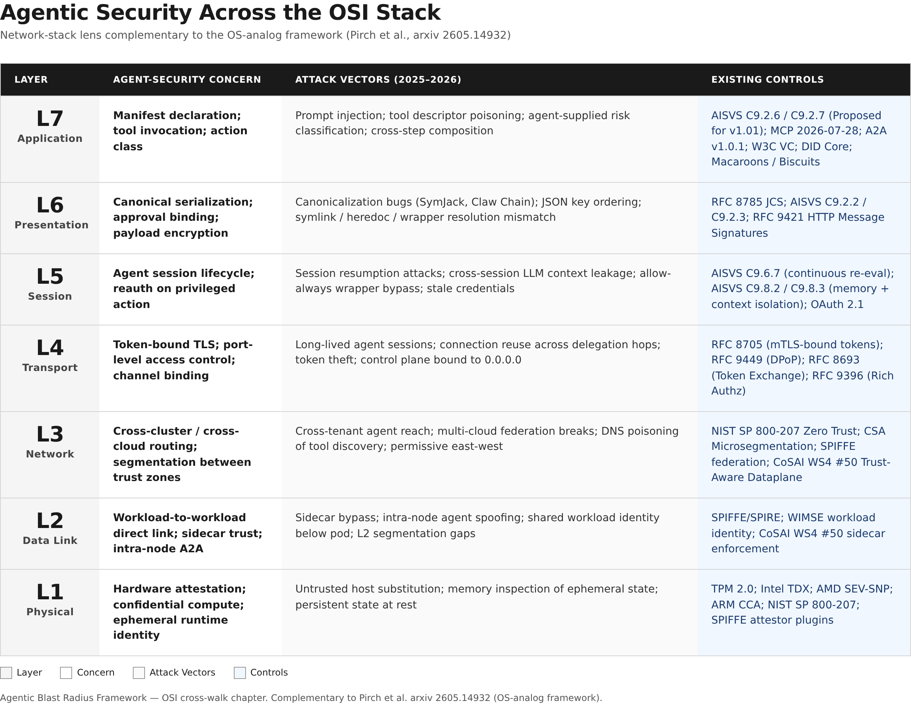
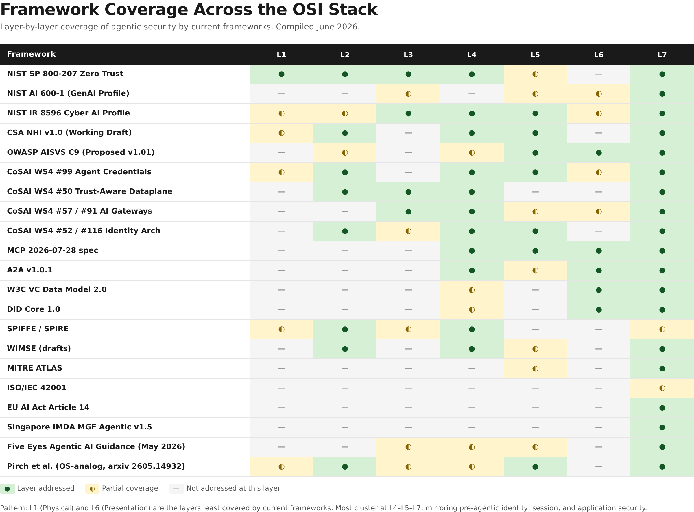

# Agentic Blast Radius Framework

Blast radius modeling for agentic systems. Five measurable axes for modeling and bounding non-human identity impact, cross-walked to existing standards.

The term *agentic blast radius* is industry-adopted vocabulary as of 2026 (NHI Management Group, Cycode, Apiiro publications). What has been missing is a structured framework that gives the term measurable axes, normative bounding requirements, and a cross-walk to existing standards. This repository is the working artifact for that framework.

---

## Axes

1. **Action class** — read-only / reversible / external-reversible / irreversible
2. **Chain depth** — single-step vs multi-hop agent-to-agent invocation
3. **External reach** — in-tenant / cross-tenant / outside-org / third-party
4. **Reversibility window** — time to detect and revert before harm propagates
5. **Identity scope** — workload-bound / shared / federated

Each axis carries bounding requirements that map to controls in existing standards.

---

## Chapters

- [OSI 7-Layer Cross-Walk](./chapter_osi_layer_crosswalk.md) — network-stack lens for agentic security; per-layer concerns, 2025-2026 attack vectors, existing controls, and gaps from L1 (Physical) to L7 (Application). Companion to Pirch et al. *arxiv 2605.14932* OS-analog framework.

Additional chapters in drafting.

---

## Visual artifacts

- 
- 

---

## Status

Under active drafting. CSA Identity and Access Management Working Group framework deliverable (topic claimed June 2026). Drafts are versioned as the framework evolves.

---

## Citation discipline applied throughout this repository

- **OWASP AISVS C9.2.6 / C9.2.7** cited as *"Proposed for v1.01"* — verbatim phrase from the merged PR text in the AISVS `research/` directory; controls are not yet in `1.0/en/`.
- **CSA NHI v1.0** cited as *"Working Draft"* — the document subtitle as of 2026-06-11.
- **CoSAI WS4 #99 Agent Credentials** cited as *"in 4-week initial-draft window"* (window opened 2026-06-04 working session).
- **CoSAI WS4 #50 Trust-Aware Dataplane** cited as *"accepted RFC"*.
- **6-property chain audit schema** joint-credited to **Mallikarjunarao Sunke** — never solo claim.
- **Pirch et al. arxiv 2605.14932** cited as the anchor for OS-analog reasoning about agent security.

---

## Anchor citation

Pirch, L., Horlboge, M., Großmann, P., Asif, S. M., Kireev, K., Holz, T., Rieck, K.
*"Toward Securing AI Agents Like Operating Systems."*
arxiv:2605.14932 (14 May 2026).

The OS-analog framework remains the cleanest host-side analysis of agent security available in the public literature as of June 2026. The OSI cross-walk chapter in this repository is intended to complement, not replace, that analysis.

---

## Related repositories

- [`Mayur021/aisvs-action-class-reference`](https://github.com/Mayur021/aisvs-action-class-reference) — reference implementation of OWASP AISVS C9.2.6 and C9.2.7
- [`Mayur021/agentic-standards-cross-walk`](https://github.com/Mayur021/agentic-standards-cross-walk) — vendor-neutral cross-walk across CSA / NIST / OWASP / CoSAI / SPDX

---

## Contributing

Issues and pull requests welcome. The framework benefits from cross-cluster review, especially:

- Per-layer attack vectors observed in production agentic deployments
- Framework coverage corrections (the matrix is a snapshot; coverage evolves)
- Joint-authored extensions where existing standards intersect with the axes

---

## License

Apache License 2.0
